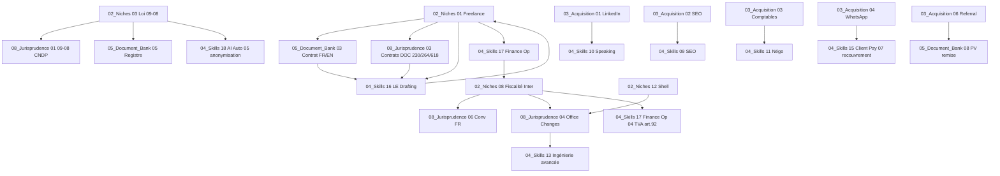

# 07 — Table des Matières Curriculum Maître (Carte Complète 10 Dossiers)

> **Version encyclopédique — 23/08/2026 — Navigation sans recherche externe. Imprimer A3 et afficher.**
> **But:** Voir d'un coup les 10 dossiers, leurs phases, leurs dépendances causales, et où reprendre sans perdre vision.
> **Volume :** ~710 docs · 22 tracks skills · 22 templates · veille légale vivante (`12_VEILLE_LEGALE`).

---

## TL;DR — Carte 1 page

```
00_START_HERE (tu es ici) ──→ 01_Strategy (règles, positionnement, déonto) ──→ 08_Jurisprudence (citable)
        │                               │                                    │
        └──────────→ 02_Niches (12×13) ←┘                                    │
                        │                                                    │
                        ▼                                                    │
                03_Acquisition (6×11) ──→ 05_Document_Bank (templates) ──→ 04_Skills
                        │                                                    │
                        └──────────→ 06_ADHD + 07_90Day (OS 90j) ──→ webapp Curriculum
```

**Ordre causal intra-dossier (à respecter sinon requalification):**
`01 Résidence 183j (CGI 23) → 09 AE/SARL (500k/200k vs IS 20 % (LF 2026)) → 02 PE 6m (art.5/7) → 07 Convention 27 → 03 Rapatriement 30j (IGOC) → 04 TVA92 → 12 Compte → 10 Provision 30 → 06/05 (09-08/OMPIC)` + volet 13→15→14 (Substance→Prix→CRS) — voir `03_Glossaire:392-410`.

---

## 1. Détail par dossier (temps lecture, langue, dépendances)

### 00_START_HERE — Onboarding (9 files, 2h, FR/EN/AR)

| # | Fichier | Temps | Langue | Dépend |
|---|---|---|---|---|
| 00 | `00_READ_ME_FIRST.md` | 15 min | FR | — |
| 01 | `01_ADHD_QuickStart_Today.md` | 20 min + 2h exec | FR | 00 |
| 02 | `02_Guide_Francais_Vault_FR.md` | 15 min | FR | 00 |
| 03 | `03_Glossaire_12_Concepts_Cles.md` | 45 min (référence) | FR (EN/AR termes) | — |
| 04 | `04_ROADMAP_NEXT_STEPS.md` | 10 min | FR | 00 |
| 05 | `05_Methode_Curriculum_Comment_Enseigner.md` | 15 min | FR | 00-04 |
| 06 | `06_Glossaire_Trilingue_50_Termes_FR_EN_AR.md` | 20 min (outil) | FR/EN/AR | 03 |
| 07 | `07_Table_Matieres_Curriculum_Maitre.md` | 10 min (tu es ici) | FR | 00-06 |
| 08 | `08_FAQ_30_Start_Here.md` | 20 min | FR (10 AR) | 00-07 |
| 09 | `09_PLAN_Fusion_V1_V2_Reprise.md` | référence historique | FR | — |
| 10 | `10_PLAN_Next_Skills.md` | 10 min | FR | 04_Skills |
| 12 | `12_VEILLE_LEGALE_2025_2026.md` | **15 min/mois (vivant)** | FR | — |
| 13 | `13_AUDIT_IMPACT_REFORMES_2026.md` | 20 min | FR | 12 |
| 14 | `14_PLAN_AUDIT_CONTENU.md` | plan qualité en cours | FR | 12-13 |

**Objectif fin 00:** Choisir 1 niche `02_Niches` + 1 canal `03_Acquisition` + envoyer 1 message.

### 01_Strategy — Big picture + déonto (78 files, 13/file, FR)

| Piliers 6 | Fichiers | Temps | Dépend | Livrable |
|---|---|---|---|---|
| 01_Rules_Of_The_Game_No_Ads | 00_INDEX +01→12 (13) | 3h | 00:03§01-02 | Liste interdit/autorisé art.31 |
| 02_Positioning_Trilingual_Tech | 13 files | 2h | 01_01 | Titre sobre Navy/Beige |
| 03_Unsaturated_Niches_Overview | 13 | 2h | 01_02 | Scoring 7 critères |
| 04_Client_Acquisition_System_No_Ads | 13 | 2h | 01_01 +03 | Funnel Impressions→Provision |
| 05_ADHD_Operating_System_Overview | 13 | 2h | 06_ADHD | OS 3MITs |
| 06_Deontologie_Pratique_Avocat_Maroc | 13 | 3h | 01_01 | Checklist avant publier |
| **13_Loi_66-23_Nouvelle_Loi_Avocats** | **5 (00_INDEX+4)** | **1h** | 06 | Checklist adaptation cabinet 66.23 |

**Lire en 2e, avant toute niche.** Déonto = non négociable.

### 08_Jurisprudence — Citable (48 files, FR, à faire avant niches)

| # | Fiches actuelles 50l | Dossier cible 6 files | Temps | Citations |
|---|---|---|---|---|
| 01 | Loi 09-08 CNDP | 00_INDEX+01→05 (5déc.) | 1h | 09-08 10k-300k |
| 02 | Loi 31-08 Conso | 6 files | 1h | 7j rétractation |
| 03 | Contrats DOC | 6 | 1h | 443/264/618/230 |
| 04 | Office Changes | 6 | 1h | Sanctions 3k-30k |
| 05 | PI OMPIC | 6 | 1h | 1.200 DH/classe |
| 06 | Fiscalité conv. | 6 | 1h | art.27 crédit |
| 07 | Social CNSS | 6 | 1h | CNSS |
| 08 | Clause pénale | 6 | 1h | Cass 2022/123 10% |
| + | 09 Barre pub +10 CRS +11 BO +12 IGOC | 12 files | 2h | — |

**Usage niche:** `02_Niches/03_Loi_09-08:43` cite `08/01` sans rechercher.

### 02_Niches_Deep_Dive — 12 niches ×13 (156 files, FR/EN+AR, cœur monétisable)

| # | Niche | Pack HT | Meet AR | Dépend | Vitesse |
|---|---|---|---|---|---|
| 01 | Freelances/Offshore | 2.900/4.900 +2.500 ret. | EN 70% | 03§01/09, 08/03 | 2-3 sem |
| 02 | Ecom/YouCan | 3.500-6k | FR | 08/02 +06/05 | 1-2 sem |
| 03 | 09-08 PME | 18k-28k +3.500 DPO | FR | 08/01 +03§06 | 4-6 sem |
| 04 | Creators | 3.900 | FR | 08/05 +06 | 3-4 sem |
| 05 | MRE Invest. | 5.900-12k | FR/EN | 03§07 +08/06 | 4-6 sem |
| 06 | AE→SARL | 2.900 | FR | 03§09 +08/06 | 2-3 sem |
| 07 | PI | 1.200/classe + packs | FR | 08/05 | 2-4 sem |
| 08 | Fiscalité Inter. | 5.900 | FR/EN | 03§07 | 4-6 sem |
| 09 | Office Changes | inclus 08 | FR | 03§03 +08/04 | — |
| 10 | MRE Entrepren. | 5.900 | FR/EN | 08-09 +10 | 4-6 sem |
| 11 | Nomads | 2.500-5k | EN | 03§08 | 3-4 sem |
| 12 | Shell/Holding | 12k (substance) | EN mots | 03§13-15 +08/11-12 | 6 sem |

**Chaque niche 13 files:** voir `05_Methode:02` (00_INDEX→12_Fiches). Lire niche choisie seulement.

### 03_Acquisition_Without_Ads — 6 canaux ×11 (66 files, FR/EN/AR Darija)

| # | Canal | Routine | Dépend | AR |
|---|---|---|---|---|
| 01 | LinkedIn Authority | 3posts/sem +10com/j +DM perm. | 01_06 déonto | EN posts |
| 02 | SEO Google Business | 2 articles/mois long-tail | 04_Skills SEO | FR |
| 03 | Partenariats Comptables | 5 msg/sem +1 atelier CCI | 01_06 (no commission) | **Darija roi** |
| 04 | WhatsApp Community | Lead magnet → WA → diagnostic | 08/01 opt-in | Darija |
| 05 | Conférences/Ateliers | 1/mois 60 min CCI | 01_01 info vs pub | FR/AR |
| 06 | Referral Engine | Demande après livraison | 05_PV remise | FR/AR |

**Choisir 1 canal 90j.** Funnel global `07_Systeme_Global` dans dossier 03.

### 04_Skills_To_Learn — Comment (~253 files, FR/EN, miroir 01)

13 dossiers (00 roadmap +01 legal tech +02 AI +03 sales fusion +04 design +06 French +07 sharp +08 livres +09 SEO +10 speaking +11 négo +12 finance +13 ingénierie). **+9 tracks Level 2 :** 14_Litigation · 15_Client_Psy · 16_LE_Drafting EN · 17_Finance_Op · 18_AI_Auto · 19_Sectors Fintech · **20_Legal_Writing · 21_Facturation_Electronique (décret attendu) · 22_Actifs_Numeriques_Crypto (projet 42-25 non promulgué)**. Voir `04_Skills/00_MASTER_INDEX`.

### 05_Document_Bank — Templates (**22 files**, FR+EN+AR 1p)

`01_Convention` +02 Scripts +03 Contrat freelance +04 CGV pack ecom +05 Registre 09-08 +06 Reçu/Facture +07 Lettre mission +08 PV clôture +09 Checklist 19pts +10 Email recouvrement +11 Calculateur provision/TVA +**12 Politique confidentialité · 13 Sous-traitance art.24 · 14 DPIA CNDP · 15 CGV formation (rétractation 7j) · 16 Sponsor/influenceur PI · 17 Checklist marque OMPIC · 18 Procuration apostillée MRE · 19 Guide formulaire 5000-F · 20 Radiation AE & quitus · 21 Devis pack · 22 CGV e-commerce loi 31-08**. Index complet : `05_Document_Bank/00_Index.md`.

### 06_ADHD_System — OS quotidien (11→24 files, EN+FR résumé)

01 Daily 3MITs →02 Notion →03 Energy →04 Pomodoro →05 Dopamine →06 Weekly →07 Recovery →08 Tech Stack →09 Fiches →10 FAQ →11 Plan30j +12 Dopamine Cabinet +13-15 prints. Voir `01_Daily:05-42`.

### 07_90Day_Plan — 0→50k (11→36 files, EN+FR)

00 Overview (0→50k `00:05-22`) +01 Foundation 1-2 +02 Traction 3-6 +03 Systemize 7-10 +04 Scale 11-13 (chaque phase 8 files) +05 Daily checklist +06 KPI tracker +07 FAQ +08 Arbre +09 Fiches +10 Plan 7j +11 Trilingue.

### webapp — Vault+Cabinet+Curriculum (offline, localStorage)

`index.html` double-clic → 3 modes toggle. Rebuild `node webapp/scripts/build.js` → `data.js` (488→~600 docs). Shortcuts `/` `[` `]` `d` (`webapp/README.md:44-51`).

---

## 2. Dépendances visuelles (à vérifier avant chaque diagnostic)

Voir `00_START_HERE/03_Glossaire:392-410` graphe interactions. Extraits:

* 01 Résidence 183j —détermine→ 09 AE/SARL + 08 Carte + 07 Convention + 02 PE
* 03 Rapatriement 30j —condition→ 04 TVA92 —preuve→ 12 Compte convertible
* 10 Provision 50% —avant→ toute mission DOC 443 >10k
* 13 Substance (bureau+2sal+PV+compta) —condition→ 15 Prix transfert + 14 CRS/BO (sinon requalification)

### Atlas cross-link (Mermaid) — niche ↔ acquisition ↔ jurisprudence ↔ template ↔ skill



**Lecture :** ouvrir une niche `02_Niches` → l'atlas montre en 1 clic la jurisprudence citable (`08_Jurisprudence`), le template (`05_Document_Bank`), et le skill à mobiliser (`04_Skills 14-19`) — aucune recherche externe.

---

## 3. Comment reprendre sans perdre vision (procédure 5 min)

1. Ouvrir `04_ROADMAP` (phase en cours)
2. Ouvrir cette table (dossier cible)
3. Ouvrir `03_Glossaire` § correspondant
4. Lire seulement `00_INDEX.md` du dossier cible (5 min)
5. Produire/lire 1 fichier à la fois (pas 13 d'un coup)

---

> **MAJ:** 23/08/2026 — 710 docs · loi 66.23 en vigueur (bannières posées) · 22 templates · plan audit contenu lancé (`14_PLAN_AUDIT_CONTENU.md`).
